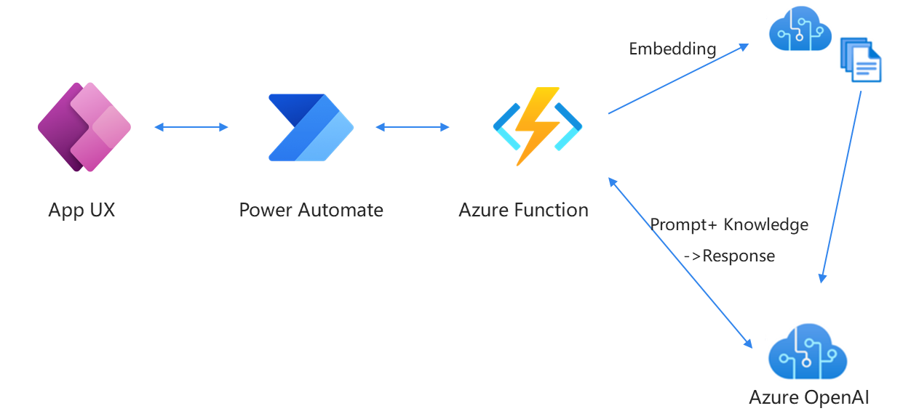

# Explore Azure OpenAI Service Embedding with Power Apps

## 前提准备

1.准备可以创作PowerApps & PowerAutomate的环境（需要Dataverse）

2.准备Azure Function

3.准备Azure OpenAI （实验中使用了text-davinci-003,text-embedding-ada-002,text-search-curie-query-001）

## 实现方案

| 名称   | 用途描述 |
  |:--- | :---- |
  | **Power Apps** | 快速构建交互页面，用于上传不同的FAQ文件(.CSV)进行Embedding和前端进行Prompt输入和问答交互 |
  | **Power Automate** | 通过HTTP Request实现Power Apps与Azure Function的接口交互 |
  | **Azure Function** | 将调用Azure OpenAI的Python代码部署在function中供低代码调用 |
  | **Azure OpenAI** | 使用GPT模型进行文本嵌入，检索以及基于匹配文本的总结 |

## 开发部署步骤

1.参考下方链接，将Embedding以及调用文本生成模型的Python代码部署到Azure Function中。

    参考代码:https://github.com/openai/openai-cookbook/blob/main/examples/Question_answering_using_embeddings.ipynb

注意Function的触发器选择Http Trigger,便于Power Automate调用。

2.使用Power Automate配置调用Azure Function的流程

3.前端使用Power Apps 画布应用构建交互页面，在调用AOAI时，借助Power Automate并传参，等待后端数据返回。

## 联系人信息

任何问题，请联系：Charlielv0926@163.com
