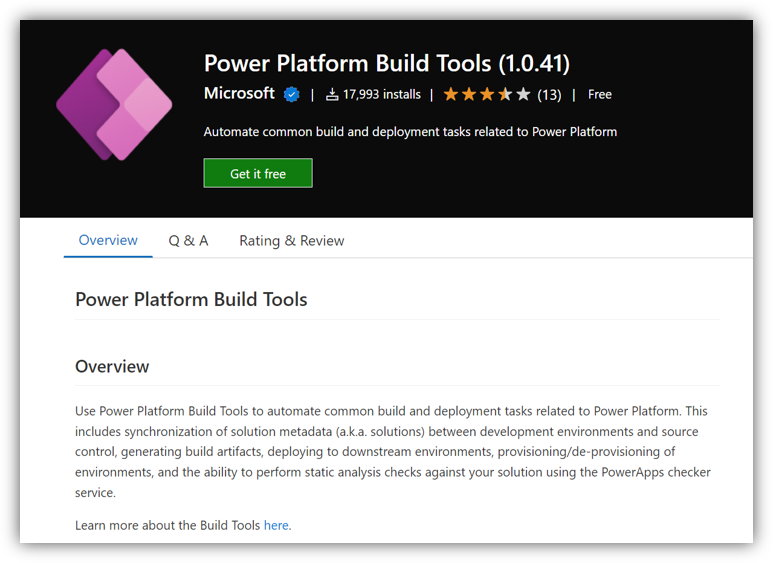

# SAP与Power Platform集成方案配置部署

## 业务背景

待补充

## 前提准备

环境申请

- [申请Power Platform试用](https://make.powerapps.com/signup?redirect=marketing)
- [申请Azure DevOps试用](https://docs.microsoft.com/en-us/azure/devops/user-guide/sign-up-invite-teammates?view=azure-devops)
- 在DevOps MarketPlace中安装所需插件
  

## 开始部署

本次实验将会按照下图的模式进行构建。模拟在实际开发场景中，针对D365/PP的Solution构建，从Dev环境生成，自动部署至UAT进行测试，以及测试通过后经过审批发布至生产的一系列操作步骤。具体如下：

**🥰本次实验的详细操作手册为放置在[LabManual目录](https://github.com/charlielv926/Biz-App-TechSolution/tree/main/PP%26D365%20CE%20Solution%20Deployment%20with%20Azure%20DevOps/LabManual)中PDF文件,可以下载至本地进行查阅。**

## 联系人信息

任何问题，请联系：Charlielv0926@163.com