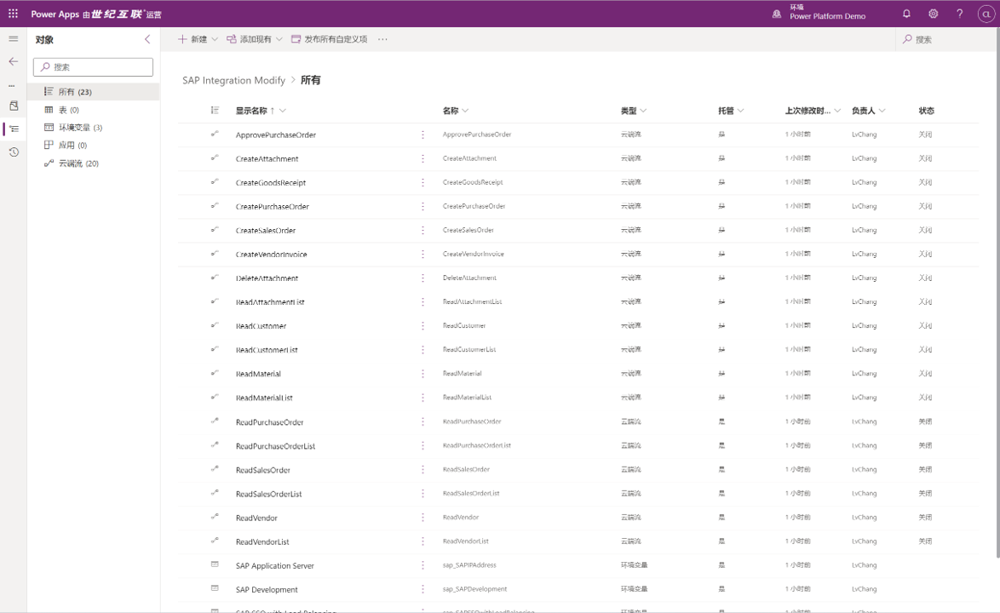
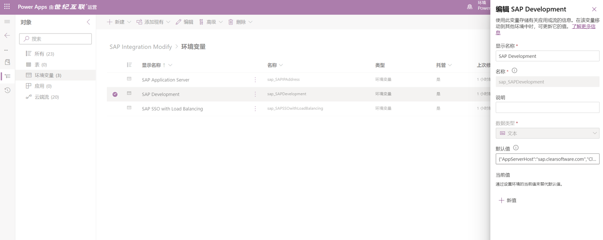
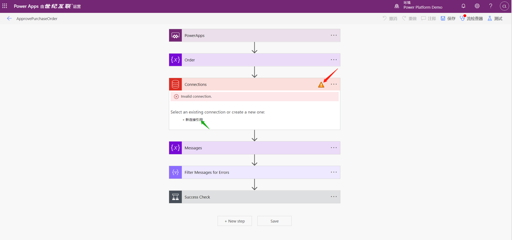
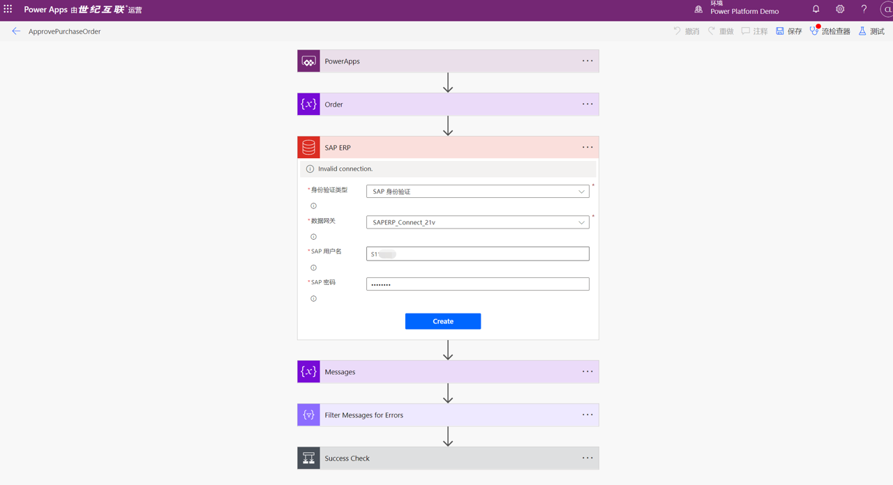
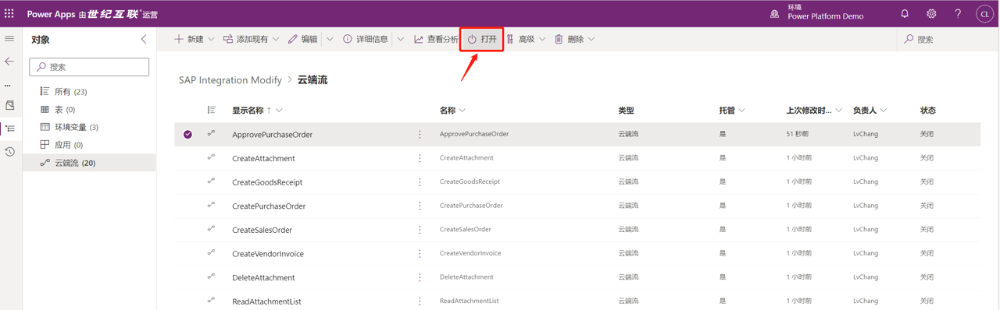
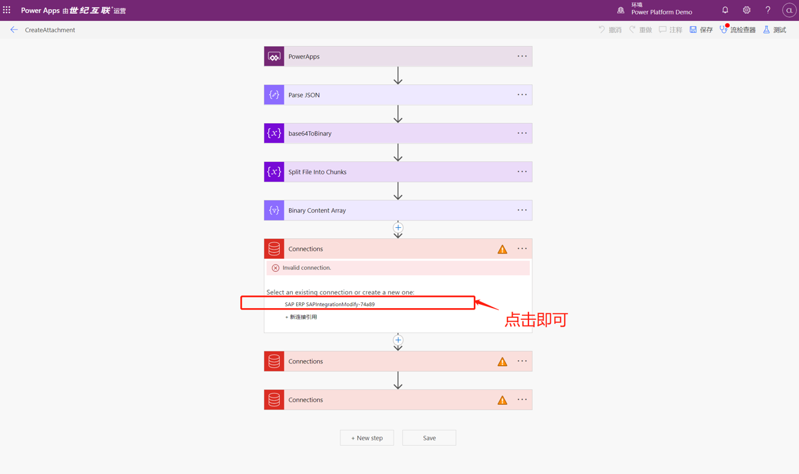
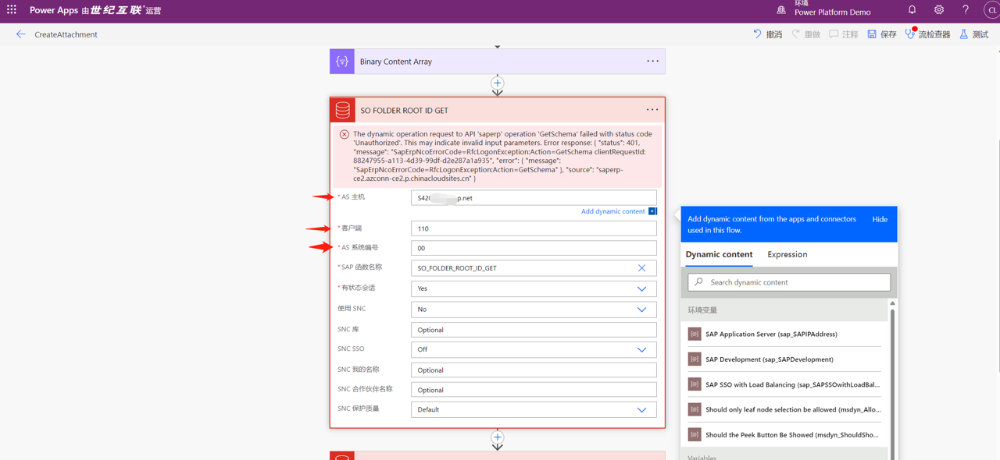
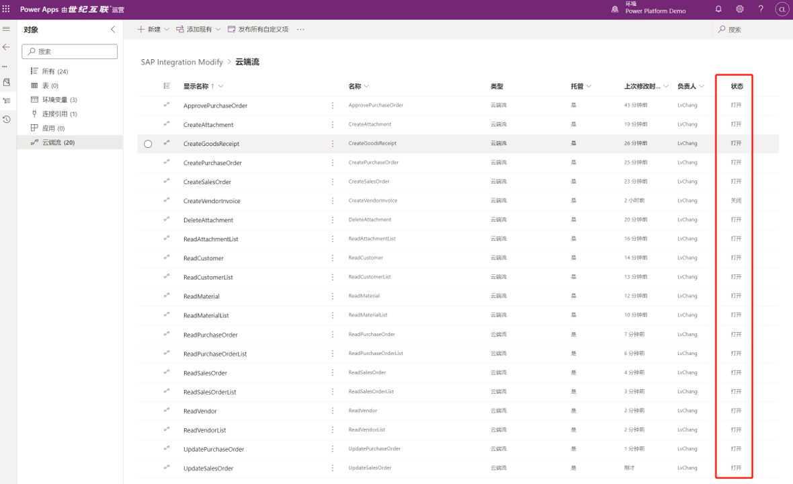

# SAP与Power Platform集成方案配置部署

## 业务背景

待补充

## 前提准备

待补充

**2.新建Unmanaged Solution，将需要修改的部分资产移入**

在solution导入环境成功后，新建非托管解决方案，将导入解决方案中的所有Flow以及环境变量添加进新的解决方案。总计20个云端流程,3个环境变量。如下图所示：

**3.修改环境变量默认值**

修改环境变量的default值，修改内容如下
| 变量名称        | 修改说明   |
| --------   | :-----  |
| SAP Application Server     | 您部署的SAP应用服务器地址   |
| SAP Development       |   {"AppServerHost":"你的应用服务地址","Client":"你的客户端代码","SystemNumber":"你的系统编号","LogonType":"ApplicationServer"}   |
| SAP SSO with Load Balancing        |    无需修改    |

修改位置参考下图：

**3.修复流程，并全部开启**

初始状态，进入每个流程的编辑页面，你会发现每个SAP ERP的Action都有错误提示，如下：

点击新建连接引用，创建SAP ERP的Connection,如下所示：

修复完成后，点击右上角进行保存操作。返回流程列表，将流程设置为开启状态，如下图：

针对列表中的flow,逐一进行修复操作，确保所有的20个flow最终状态都为打开状态。
从第二个流程修复开始，无需重新建立connection，复用原有的connection即可，请参考下图：

部分流程中需要更改相关SAP参数配置：

确认最终所有的流程状态如下：

图示未开启的流程需要Office365 License，非必须开启。
## 联系人信息

任何问题，请联系：Charlielv0926@163.com
